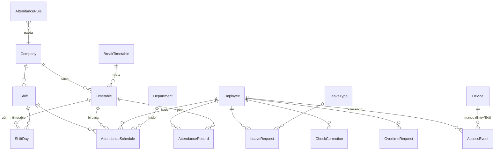

# Davamiyyət (Time & Attendance) modulunun dizaynı

> Məqsəd: HikCentral Access Control-un **Attendance** modulundakı imkanları öz sistemimizdə (Onion, ASP.NET Core, MSSQL) **öz motorumuzla** (cihazlardan xam keçidləri çəkib özümüz hesablayaraq) qurmaq. HikCentral məhsulundan asılı deyilik; yalnız Hikvision **cihazları** məlumat mənbəyidir.
>
> Bu sənəd tikinti spesifikasiyasıdır. Kod yazılmamışdan əvvəl razılaşdırılır. Status: **DRAFT — təsdiq gözləyir**.

---

## 1. HikCentral → bizim sistem uyğunluq cədvəli

| HikCentral konsepti | Bizdə qarşılığı | İndiki status |
|---|---|---|
| **Timetable** (bir günün qaydası: check-in/out aralığı, working time, tip) | `Timetable` (mövcud `WorkSchedule` genişlənir) | Qismən (sadə start/end/grace) |
| **Break Timetable** (fasilələr) | `BreakTimetable` | Yox |
| **Shift** (timetable-ların günlərə/dövrə düzülüşü) | `Shift` + `ShiftDay` | Yox |
| **Schedule** (növbəni şəxsə/şöbəyə tarix aralığında təyin) | `AttendanceSchedule` | Yox (indi birbaşa FK) |
| **Attendance Rule** (qlobal hesablama qaydaları) | `AttendanceRule` | Yox |
| **Leave** (məzuniyyət + təsdiq) | `LeaveType` + `LeaveRequest` | Yox |
| **Check In/Out Correction** (əl ilə düzəliş) | `CheckCorrection` | Yox |
| **Overtime** (əlavə iş sorğusu) | `OvertimeRequest` | Yox |
| **Attendance Calculation** (motor) | `AttendanceCalculationService` (arxa-plan job + əl ilə) | Yox |
| **Attendance Record** (gündəlik nəticə) | `AttendanceRecord` | Yox (indi anlıq hesablanır) |
| **Reports** (Total Time Card, Worked Hrs, Late, Overtime, Leave) | `AttendanceReportService` genişlənir | Qismən (xam giriş/çıxış sayı) |
| **Holiday** (bayram təqvimi) | `Holiday` | Yox |

**Əsas prinsip:** HikCentral-da **Timetable ≠ Shift ≠ Schedule** — üç ayrı qat:
- **Timetable** = bir günün qaydası (day-agnostic).
- **Shift** = hansı gün hansı timetable (həftəlik və ya N-günlük dövrü, rotasiya).
- **Schedule** = kim, hansı tarix aralığında, hansı Shift.

---

## 2. Domen modeli (entity-lər)

Mövcud entity-lər üstündə qurulur: `Employee` (Entry/Exit yönlü cihazlardan keçir), `Department`, `Company`, `Device` (Direction), `AccessEvent`, `EmployeeMatcher` (keçidi işçiyə bağlayır).

### 2.1 Timetable (mövcud `WorkSchedule` genişlənir)

```
Timetable : BaseEntity
  CompanyId?          // null = qlobal
  Name
  Type                // Normal | Flexible          (YENİ)
  WorkStart, WorkEnd  // TimeSpan  (mövcud StartTime/EndTime)
  // Keçərli oxutma pəncərələri (YENİ) — HikCentral "Check-In/Out Time Period"
  CheckInStart, CheckInEnd     // məs. 07:00–11:00
  CheckOutStart, CheckOutEnd   // məs. 16:00–20:00
  LateGraceMinutes             // mövcud GraceMinutes → gecikmə icazəsi
  EarlyLeaveGraceMinutes       // erkən çıxış icazəsi (YENİ)
  AbsentAfterMinutes           // check-in bu qədər gecikəndən sonra = qayıb (YENİ)
  MinWorkMinutes               // Flexible üçün minimum işlənmə (YENİ)
  BreakTimetableId?            // fasilə (YENİ)
  Color                        // təqvim rəngi (YENİ)
  Mon..Sun                     // "birbaşa təyinat" rejimi üçün (Shift-siz sadə yol)
  IsActive
```

> **Normal Shift** — sabit: gecikmə/erkən çıxış WorkStart/WorkEnd-ə görə. **Flexible Shift** — çevik: yalnız ümumi işlənmiş vaxt sayılır (MinWorkMinutes).
>
> `Mon..Sun` sahələri saxlanır ki, **Shift qatı olmadan** (Faza 2–3) timetable birbaşa şöbəyə/işçiyə təyin oluna bilsin. Shift (Faza 4) gələndə rotasiya bu sahələri əvəz edir.

### 2.2 BreakTimetable

```
BreakTimetable : BaseEntity
  CompanyId?
  Name                 // "Nahar 12:00–13:00"
  BreakStart, BreakEnd
  DurationMinutes      // sabit çıxılan müddət
  AutoDeduct           // true = oxutmadan avtomatik çıxılır; false = fasilə oxutması ilə
  IsActive
```

### 2.3 Shift + ShiftDay  *(Faza 4)*

```
Shift : BaseEntity
  CompanyId?
  Name                 // "5/2 həftəlik", "Növbəli 2/2"
  CycleType            // Weekly | CustomDays
  CycleLength          // Weekly=7; Custom=N
  IsActive

ShiftDay
  ShiftId
  DayIndex             // Weekly: 0=B.e … 6=B; Custom: 0..N-1
  TimetableId?         // null = istirahət günü
```

### 2.4 AttendanceSchedule (təyinat)  *(Faza 4)*

```
AttendanceSchedule : BaseEntity
  CompanyId
  TargetType           // Employee | Department
  TargetId
  ShiftId?             // növbə ilə
  TimetableId?         // və ya birbaşa tək timetable
  StartDate, EndDate?  // EndDate null = davam edir
  Priority             // Employee > Department (override)
```

** Həlletmə (resolution) qaydası** — verilmiş `işçi + tarix` üçün:
1. İşçiyə birbaşa aktiv `AttendanceSchedule` varsa onu götür; yoxsa şöbəsininkini.
2. Shift varsa → həmin həftə-günü/dövr-gününə uyğun `ShiftDay.TimetableId`; birbaşa Timetable varsa onu.
3. Nəticə `null` (istirahət) və ya `Timetable`.

> **Faza 2–3 keçid rejimi:** `AttendanceSchedule` hələ yoxdursa, indiki `Employee.WorkScheduleId` / `Department.WorkScheduleId` + Timetable-ın `Mon..Sun` sahələri ilə həll olunur. Beləliklə hesabat motoru Shift qatından ƏVVƏL işləyə bilər.

### 2.5 AttendanceRule (qlobal/şirkət üzrə)

```
AttendanceRule : BaseEntity
  CompanyId?           // null = default; şirkət üzrə override
  DefaultLateGrace, DefaultEarlyLeaveGrace
  AbsentThresholdMinutes
  MinOvertimeMinutes           // bundan az əlavə iş sayılmır
  RoundingMinutes              // 0 | 5 | 15 (yuvarlaqlaşdırma)
  MissingCheckoutPolicy        // Absent | UseLastScan | Incomplete
  CountWeekendAsAbsent         // bool
  RequireOvertimeApproval      // true = yalnız təsdiqli əlavə iş sayılır
```

### 2.6 AttendanceRecord (gündəlik nəticə — PERSİST olunur)

```
AttendanceRecord : BaseEntity
  CompanyId, EmployeeId, Date
  TimetableId?                 // həll olunmuş
  ScheduledStart, ScheduledEnd // o günün planı
  FirstCheckIn?, LastCheckOut? // faktiki
  WorkedMinutes
  LateMinutes, EarlyLeaveMinutes, AbsentMinutes, OvertimeMinutes
  Status                       // Normal | Late | EarlyLeave | Absent |
                               // Rest | Leave | Holiday | Incomplete
  Source                       // Calculated | Manual
  IsLocked                     // aylıq bağlandıqda yenidən hesablanmır
  UNIQUE(EmployeeId, Date)
```

> Niyə persist? HikCentral kimi — nəticə sabit qalsın, əl ilə düzəldilə bilsin, hesabat sürətli olsun. İndiki `ReportService` hər dəfə cihazdan çəkib anlıq hesablayır (yavaş, düzəlişsiz).

### 2.7 HR qeydləri  *(Faza 4)* — birbaşa HR/admin daxil edir (self-service sonra)

```
LeaveType : BaseEntity          // "İllik məzuniyyət", "Xəstəlik", "Ezamiyyət"
  CompanyId?, Name
  CountsAsWorked                // Ezamiyyət=true (işdə sayılır); məzuniyyət=false
  Paid, Color

LeaveRecord : BaseEntity        // HR birbaşa yaradır → dərhal təsdiqli
  EmployeeId, LeaveTypeId, StartDate, EndDate, Reason
  CreatedByUserId               // HR/admin
```

Faza 5-də əlavə olunur (əl ilə düzəliş):
```
CheckCorrection : BaseEntity
  EmployeeId, Date, Type (CheckIn|CheckOut), RequestedTime, Reason
  ApprovedByUserId, ApprovedAt
```

Faza 6-da (self-service + təsdiq axını): `LeaveRequest`, `OvertimeRequest` (Pending→Approved, admin təsdiqi).

### 2.8 Holiday  *(Faza 6, opsional)*

```
Holiday : BaseEntity
  CompanyId?, Date, Name
```

---

## 3. ER diaqramı



---

## 4. Hesablama motoru (AttendanceCalculationService)

**Tetikləyicilər:** (a) hər gecə arxa-plan job (mövcud `DeviceEventPoller` yanında yeni hosted service), (b) UI-dan "Yenidən hesabla" düyməsi (tarix aralığı + şöbə/işçi).

Hər **işçi × hər gün** üçün alqoritm:

1. **Planı həll et** → `AttendanceSchedule` (yoxsa keçid rejimi: `WorkScheduleId` + `Mon..Sun`) → Shift → o günün `Timetable`-ı.
2. İstirahət/bayramdırsa → `Status = Rest/Holiday` (təsdiqli overtime yoxdursa dayan).
3. **Xam skanları çək:** o günün keçidləri (`AccessEvent` DB-dən və ya cihazdan), `EmployeeMatcher` ilə işçiyə bağla, cihazın `Direction`-una görə giriş/çıxışa ayır.
4. **Düzəlişləri tətbiq et** (təsdiqli `CheckCorrection`) → virtual skan əlavə et.
5. **Məzuniyyəti tətbiq et** (təsdiqli `LeaveRequest`) → `Status = Leave`, qayıb sayma.
6. **Hesabla:**
   - `FirstCheckIn` = check-in pəncərəsindəki ən erkən giriş (Flexible-də sadəcə ən erkən skan).
   - `LastCheckOut` = ən son çıxış (`MissingCheckoutPolicy`-ə görə yoxdursa).
   - `Late = max(0, FirstCheckIn − ScheduledStart − LateGrace)`.
   - `EarlyLeave = max(0, ScheduledEnd − LastCheckOut − EarlyLeaveGrace)`.
   - `WorkedMinutes = (LastCheckOut − FirstCheckIn) − fasilə(lər)`.
   - `AbsentAfterMinutes`-ə qədər girişi yoxdursa → `Status = Absent`.
   - `Overtime` = plandan sonra işlənən (qaydaya görə auto və ya təsdiqli).
7. **Yuvarlaqlaşdır** (`RoundingMinutes`), `AttendanceRecord` yaz (əgər `IsLocked`/`Manual` deyilsə).

> **Gecə növbəsi (yarımgecəni keçən):** ilk versiyada dəstəklənmir — qeyd olunur, Faza 4-də əlavə edilir (çıxış ertəsi günə düşəndə).

---

## 5. Hesabatlar (AttendanceRecord üstündə)

Hamısı **şirkət + şöbə + işçi + tarix aralığı** filtri ilə; ixrac: Excel/PDF/CSV.

| Hesabat | Məzmun |
|---|---|
| **Total Time Card** | İşçi × ay grid; hər xana = status simvolu + saat; sağda cəmlər (işlənmiş/gecikmə/qayıb/əlavə) |
| **Worked Hours** | Dövr üzrə işçi başına ümumi işlənmiş saat |
| **Late Report** | Gecikmə hadisələri (tarix, dəqiqə) |
| **Overtime Report** | Təsdiqli əlavə iş saatları |
| **Leave Report** | Növ üzrə götürülmüş məzuniyyət |
| **Daily/Absence** | Gündəlik status + işə gəlməyənlər |

---

## 6. Mərhələli tikinti planı

> **Qərarlara görə yenilənmiş plan** (Break/Shift/gecə növbəsi təxirə salındı; Bayram/Məzuniyyət/Ezamiyyət öndə).

| Faza | Nə tikilir | Entity/servis |
|---|---|---|
| **2** ← indi | Timetable-i gücləndir | `WorkSchedule`-ə: Type(Normal/Flexible), CheckIn/Out pəncərələri, EarlyLeaveGrace, AbsentAfter, MinWork, Color + Ayarlar UI |
| **3** | **Motor + əsas hesabatlar** | `AttendanceRule`, `AttendanceRecord`, `AttendanceCalculationService`, Total Time Card + Late + Worked Hrs + Gündəlik/Qayıb |
| **4** | HR: Bayram/Məzuniyyət/Ezamiyyət → motora | `Holiday`, `LeaveType`, `LeaveRecord`(məzuniyyət/ezamiyyət), motora inteqrasiya + Leave hesabatı |
| **5** | İxrac + aylıq kilid | Excel + PDF export, `AttendanceRecord.IsLocked`, əl ilə düzəliş (`CheckCorrection`) |
| **6** (sonra) | Shift rotasiya, gecə növbəsi, self-service sorğu+təsdiq, Overtime axını, Break | `Shift/ShiftDay/AttendanceSchedule`, `OvertimeRequest`, `BreakTimetable` |

Hər faza müstəqil dəyər verir; **Faza 3-dən sonra sistem artıq gecikmə/qayıb/işlənmiş saat verən işlək davamiyyət sistemidir.**

> **Dinamik iş günləri:** işçi yalnız müəyyən günlər işləyirsə (məs. B.e/Ç/C), ona o günləri işarələnmiş ayrıca timetable təyin olunur (`WorkSchedule.Mon..Sun`). Bu, Shift qatı olmadan işləyir.

---

## 7. Multi-tenancy və inteqrasiya qeydləri

- Bütün yeni entity-lər `CompanyId` daşıyır + `AppDbContext` global query filter (mövcud pattern: `CanSeeAllCompanies || CompanyId == tenant`).
- Xam mənbə: `AccessEvent` (cihazdan `DeviceEventPoller` ilə toplanır) + `EmployeeMatcher` (İşçi İD/AccessNumber üzrə). **Ön şərt:** işçinin cihaz ID-si = `EmployeeNo`/`AccessNumber` (artıq standartlaşdırılıb).
- Cihazın `Direction` (Entry/Exit) giriş/çıxışı ayırır — bu artıq var.
- Təsdiq axını rol əsaslıdır (`Role`/`RolePermission`); təsdiqləyən = rəis/təhlükəsizlik admini (dəqiqləşdiriləcək).

---

## 8. Təsdiqlənmiş qərarlar (2026-08-05)

1. **Gecə növbəsi:** indilik YOX — yalnız gündüz. Yarımgecəni keçən növbə sonraya (Faza 6).
2. **Rotasiyalı iş:** ağır Shift qatı indilik YOX. Amma **dinamik iş günləri** lazımdır — işçi məs. yalnız B.e/Ç/C (1,3,5-ci günlər) işləyə bilər. Bu, **Timetable-ın `Mon..Sun` günləri + işçiyə fərdi timetable təyini** ilə həll olunur (fərqli günlər üçün fərqli timetable). Shift/rotasiya Faza 6-ya.
3. **Fasilə:** avtomatik çıxılmasın — `BreakTimetable` indilik təxirə salınır.
4. **Təsdiq:** indiki mərhələdə **rəhbər = admin** təsdiq verir. Tam self-service sorğu/təsdiq axını sonraya; hələlik **HR/admin birbaşa qeyd** edir.
5. **Bayram + Məzuniyyət + Ezamiyyət:** HR birbaşa əlavə edə bilməlidir və hesabatda avtomatik nəzərə alınmalıdır (bayram = qayıb sayılmır; ezamiyyət = işdə sayılır; məzuniyyət = üzrlü). → Faza 4-ə çəkildi (əvvəlki 5/6 yerinə).
6. **İxrac:** Excel + PDF (CSV opsional).

## 8.1 Yenilənmiş məhdudiyyətlər
- **BusinessTrip (Ezamiyyət)** yeni status/qeyd növü kimi əlavə olunur (§2.7) — işçi ofisdə deyil amma **işdə sayılır**, qayıb yox.
- HR birbaşa qeyd etdiyi üçün ilkin versiyada `LeaveRequest`/`OvertimeRequest`-in **təsdiq axını sadələşir**: HR yaradır → dərhal təsdiqli. Self-service sonra.
```
